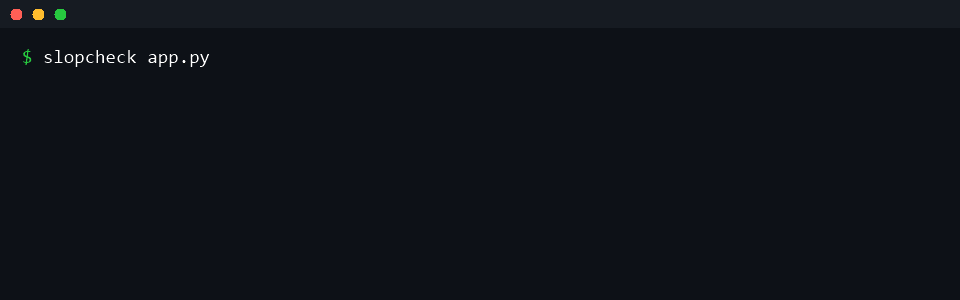

# vibe-tools

**Small CLIs for the new pains of coding with AI: cost, context, and supply-chain safety.**

Coding with LLMs created a fresh set of papercuts that didn't exist three years
ago. You fire a prompt without knowing the bill. You copy-paste files into a
chatbot one by one and blow the context window (or leak a key). An assistant
tells you to `pip install` something that doesn't exist. These three tools each
fix one of those papercuts. Zero dependencies, pure stdlib, one job each.

> Each tool was scoped from a *recent, real* complaint surfaced on Reddit (see
> [Why these three](#why-these-three)). The goal isn't a framework - it's three
> things you'd actually drop into a shell alias.



```bash
pip install -e .        # or just run with `python -m vibe_tools.<tool>`
```

---

## `llmcost` — price a prompt before you send it

> Pain: r/artificial, June 2026 — *"Our AI bills are subsidised, and I don't
> think many people have priced in what happens next"* (221 pts, 208 comments).

Counts tokens for any text / file / directory and estimates the USD cost across
today's models, sorted cheapest-first, so you can see what a request will cost
*before* you spend it.

```bash
echo "summarise this design doc" | llmcost
llmcost README.md vibe_tools/            # price a whole folder
llmcost --text "..." --output-tokens 800 --json
```

```
Input: 1,204 tokens from 6 source(s) (tokenizer=heuristic); assuming 500 output tokens

model                in $       out $      total $
-----------------    ---------  ---------  ----------
gpt-5-mini             0.0003     0.0010      0.0013
claude-haiku-4-5       0.0012     0.0025      0.0037
claude-sonnet-4-6      0.0036     0.0075      0.0111
claude-opus-4-8        0.0181     0.0375      0.0556
```

- Token counts default to an offline heuristic (~4 chars/token). Pass
  `--tokenizer tiktoken` for exact `cl100k_base` counts (needs `tiktoken`).
- Prices live in [`pricing.json`](vibe_tools/pricing.json) and are **indicative** — verify
  against each provider's pricing page, or override with `--pricing your.json`.

## `ctxpack` — pack a repo into one LLM-ready file

> Pain: r/ChatGPTCoding, recurring 2026 — people paste whole codebases into a
> chatbot file by file, drown the context window in `node_modules`/lockfiles,
> and sometimes leak an API key into the prompt.

Walks a tree (skipping `.git`, `node_modules`, venvs, binaries, lockfiles),
builds a file-tree + per-file fenced bundle, enforces a token budget, and warns
(or redacts) when it spots a credential.

```bash
ctxpack .                                  # -> stdout, a single markdown bundle
ctxpack src/ --out context.md --max-tokens 100000
ctxpack . --redact                         # scrub secrets before packing
ctxpack . | llmcost                        # pack, then price it
```

The bundle is plain stdout, so it pipes straight into `llmcost` or your
clipboard. Diagnostics (budget skips, secret warnings) go to stderr.

## `slopcheck` — catch hallucinated & typosquatted packages

> Pain: 2026 supply-chain risk ("slopsquatting") — assistants confidently
> suggest `pip install <pkg>` for packages that don't exist, or typosquats one
> character away from a real one that an attacker has registered.

Reads the imports/requirements an LLM handed you and reports which packages are
real, which don't exist on PyPI, and which look like typosquats of popular
packages. Non-zero exit on anything suspicious — drop it in CI or a pre-commit
hook.

```bash
slopcheck app.py                  # check imports in a file
slopcheck requirements.txt        # check a requirements file
slopcheck src/ --json             # walk a dir, machine-readable
slopcheck --offline app.py        # typosquat heuristics only, no network
```

```
package              status
------------------   ------------------
requests             ok
reqeusts             NOT FOUND  (not on PyPI - did you mean 'requests'?)
super-helper-ai-42   NOT FOUND  (not on PyPI - likely hallucinated)

[!] 2 suspicious package(s) of 3 checked. Verify before installing.
```

---

## Why these three

These aren't hypothetical. Each was picked from a current Reddit pain point
about working with AI day-to-day, then scoped down to the smallest tool that
actually removes the papercut:

| Tool | Pain | Source signal |
|------|------|---------------|
| `llmcost` | No idea what a prompt/repo costs before sending | r/artificial — "Our AI bills are subsidised…" (221 pts) |
| `ctxpack` | Manual copy-paste of code into chatbots; context blowout; leaked keys | r/ChatGPTCoding — recurring "dropped my whole file into context" |
| `slopcheck` | AI suggests fake / typosquatted packages | 2026 "slopsquatting" supply-chain reports |

## Install & test

```bash
pip install -e ".[dev]"
pytest -q
```

No runtime dependencies. `tiktoken` is optional (`pip install -e ".[tiktoken]"`)
and only used by `--tokenizer tiktoken`.

## License

MIT — see [LICENSE](LICENSE).
